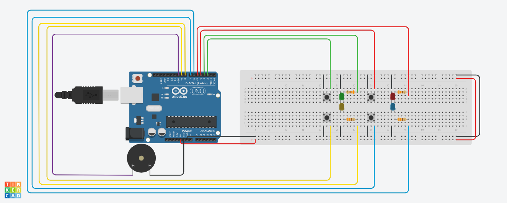
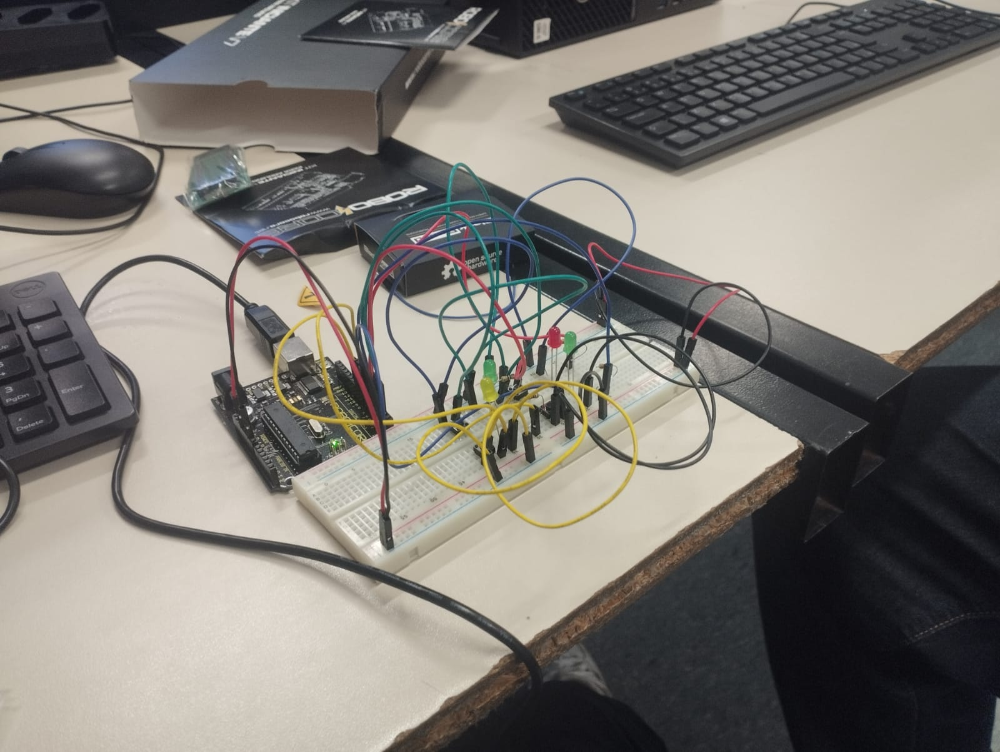

# Genius Arduino
## Descrição:
**Projeto criado para LIPE (Laboratorio de Iniciação a programação) na PUC MINAS - Coração Eucaristico, que tem como finalidade reproduzir o mesmo sistema do jogo Genius, porém elaborado em um arduino UNO R3.**

### Projeto do sistema do jogo [*Genius*](https://www.estrela.com.br/jogo-genius-estrela/p) feito no arduino [*UNO R3*](https://docs.arduino.cc/hardware/uno-rev3) no [*TINKERCAD*](https://www.tinkercad.com):

---
### Arduino fisico montado de acordo com o projeto do Tinkercad, replicando o sistema do jogo Genius:

### [**LINK DO PROJETO NO TINKERCAD**](https://www.tinkercad.com/things/2iErsKXSMNn-genius-arduino)

